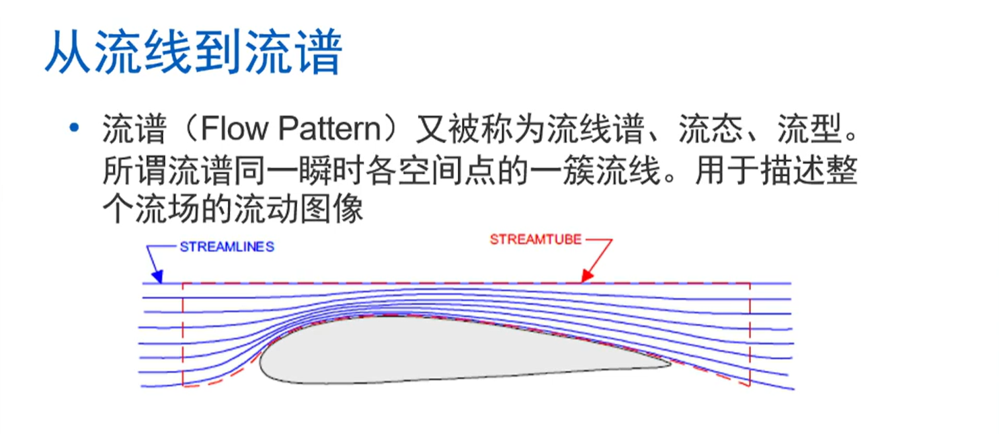

# 🚀学习Gazebo插件写法 
## 物理背景
### 伯努利定律

#### 质量守恒原理
对于不可压缩流体（如低速空气、水），有：
\[
A_1 v_1 = A_2 v_2
\]
- \(A \):截面积 ， \( v \):流速

当通道变窄\(A_2 < A_1​ \)时：
\[v_2 > v_1 \]
#### 伯努利原理公式

伯努利原理的核心公式表达的是：**在理想流体定常流动中，流速越大，压强越小**。其常见公式有以下两种形式：

##### 1. 标准形式（沿同一条流线）

\[
P + \frac{1}{2} \rho v^2 + \rho g h = \text{常数}
\]

##### 2. 压力形式（水平管或忽略高度变化时）

\[
P_1 + \frac{1}{2} \rho v_1^2 = P_2 + \frac{1}{2} \rho v_2^2
\]

---

##### 符号含义

| 符号 | 含义 | 单位（国际） |
|------|------|--------------|
| \(P\) | 流体该点的**静压** | Pa (N/m²) |
| \(\rho\) | 流体密度（常数） | kg/m³ |
| \(v\) | 该点的流速 | m/s |
| \(g\) | 重力加速度（约9.8 m/s²） | m/s² |
| \(h\) | 相对参考面的高度 | m |

- 第一项 \(P\)：静压，流体实际作用于壁面的压力。
- 第二项 \(\frac{1}{2}\rho v^2\)：动压，速度产生的压力效应。
- 第三项 \(\rho g h\)：位压，高度产生的压力效应。

---

##### 适用条件（非常重要）

凡是使用该公式，必须满足：

1. **理想流体**：无粘性（忽略内摩擦）。
2. **定常流动**：各点流速、压力不随时间变化。
3. **不可压缩流体**：密度 \(\rho\) 为常数。
4. **沿同一条流线**（或流动无旋时适合全场）。

如果气体且马赫数 \(Ma < 0.3\)（低速），也可近似使用。

---

##### 快速理解记忆

> **总压 = 静压 + 动压 + 位压 = 常数**

- 流速高的地方，动压大 → 静压小（如飞机机翼上方）。
- 水平流动中，位压不变 → 流速增加则压力降低（如水流通过变细管）。

